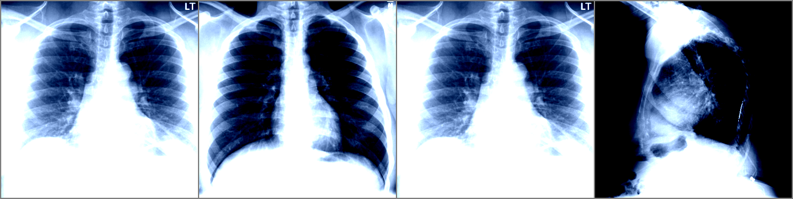

# radiology-clip-mini


Minimal CLIP-style baseline on the IU X-Ray dataset for image–text retrieval, with a compact training pipeline, evaluation suite, and Grad-CAM visualization. Designed as a clean, reproducible reference implementation.

---

## Highlights

* **Image encoder:** ResNet‑18 (ImageNet) + linear projection → **256‑D**
* **Text encoder:** DistilBERT + linear projection → **256‑D**
* **Loss:** symmetric InfoNCE with learnable temperature
* **Evaluation:** Recall@1/5/10, Median Rank, nDCG@10
* **Visualization:** retrieval grid and single-image Grad‑CAM
* **Hardware:** any consumer GPU (GTX‑1650/T4) or CPU (slow but feasible)

---

## Repo layout

```
radiology-clip-mini/
├─ configs/        # YAML configs (explicit hyperparams)
├─ notebooks/      # Interactive demo for inference & visualization
├─ results/        # Run outputs (ckpts, metrics, figures) — git‑ignored
├─ src/rclip/      # Library code: data, models, train, eval, viz
└─ scripts/        # Small utilities
```

---

## Quickstart (local)

```
git clone https://github.com/MahshadSa/radiology-clip-mini.git
cd radiology-clip-mini

python -m venv .venv
# Windows:
.venv\Scripts\activate
# Linux/macOS:
# source .venv/bin/activate

pip install -r requirements.txt

# Train (writes results/<YYYYMMDD-HHMMSS>/ and updates results/latest.txt)
python -m rclip.train --config configs/tiny.yaml

# Evaluate + visualize
python -m rclip.eval --ckpt "$(cat results/latest.txt)"
python -m rclip.viz  --ckpt "$(cat results/latest.txt)"
```

---

## Quickstart (Kaggle)

```
!git clone https://github.com/MahshadSa/radiology-clip-mini.git
%cd radiology-clip-mini
!pip install -r requirements.txt

!python -m rclip.train --config configs/tiny.yaml
!python -m rclip.eval  --ckpt $(cat results/latest.txt)
!python -m rclip.viz   --ckpt $(cat results/latest.txt)
```

---

## Data

* Dataset: **IU X-Ray / OpenI** via Hugging Face (`ykumards/open-i`).
* Text field priority: **findings → impression → report → text**.
* Patient‑level splits ensure no leakage across train/val/test.
* The default config uses a **small ~30‑patient subset** for rapid demonstration.

---

## Configuration (example: `configs/tiny.yaml`)

```
seed: 42

data:
  cache_dir: null
  split_spec: train[:500]
  max_patients: 30
  image_size: 320
  num_workers: 0
  split_file: data/splits_tiny.json

train:
  epochs: 4
  batch_size: 16
  lr: 3e-4
  weight_decay: 1e-4
  grad_clip: 1.0
  amp: false

model:
  embed_dim: 256
  image_encoder: resnet18
  text_encoder: distilbert-base-uncased
  temperature_init: 0.07

paths:
  results_dir: results
```

---


## Retrieval performance (tiny experiment)

Using `train[:500]` (~30 patients), ResNet‑18 image encoder, and DistilBERT text encoder.

| Direction    | R@1  | R@5  | R@10 | MedR | nDCG@10 |
| ------------ | ---- | ---- | ---- | ---- | ------- |
| Image → Text | 0.67 | 1.00 | 1.00 | 1    | 0.877   |
| Text → Image | 0.33 | 1.00 | 1.00 | 2    | 0.710   |

Metrics are written automatically to `results/<run>/metrics.json`.

---
## Example Image→Text Retrieval

A sample retrieval grid from the validation set. The first image is the query, followed by its top retrieved matches.

<p align="center">
  
</p>

---
## Grad-CAM Example

Grad-CAM style visualization of the last convolutional block of the image encoder for a sample chest X-ray.

<p align="center">
  
</p>

---

## Reproducibility notes

* Deterministic seeds and config snapshot saved in `run.json`.
* All metrics auto‑saved to the run directory.
* Figures (`retrieval_grid.png`, `gradcam_example.png`) stored under `results/<run>/viz/`.
* The notebook `notebooks/01_demo_radiology_clip_mini.ipynb` provides a small interactive walkthrough.

---
## Limitations

- Uses a very small subset of OpenI for speed; full-dataset metrics will differ.
- Only single-view IU X-Ray samples are used; multi-view fusion is not included.
- The model is a small CLIP-style baseline (ResNet-18 + DistilBERT); stronger encoders can improve retrieval.
- Clinical reports in OpenI have noise and incomplete fields; text quality affects performance.
- Not intended for clinical decision-making.

---
## Roadmap

- Add full IU X-Ray training configuration.
- Compare against BiomedCLIP or PubMedCLIP.
- Add multi-view (PA + lateral) fusion baseline.
- Add zero-shot query examples for clinical phrases.
- Add unit tests for data loaders and model forward passes.
- Add a lightweight Streamlit demo for retrieval.

---

## Citation

* Radford et al., **Learning Transferable Visual Models From Natural Language Supervision (CLIP)**, 2021.
* Demner‑Fushman et al., **Preparing a Collection of Radiology Examinations for Distribution and Retrieval**, 2016 (IU X‑Ray).

---

## License and usage

MIT License.
For research and educational purposes only; not for clinical decision‑making.
